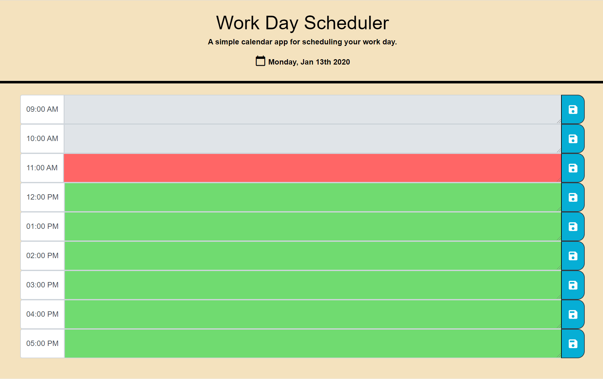

# DayPlanner

## Description
The goal of this assignment was to create a basic browser-based calendar application an employee who works standard business hours to easily plan their activities for the current workday. It has the following capabilities:

* Spans standard business hours (9a to 5p)
* Time is broken into hour-long blocks
* Uses colors to highlight past (gray), current (red) and upcoming (green) events of the day
* Current date is displayed at the top
* Fields to hold user input with the capability to save for future access

## Deployment
https://nunetang.github.io/DayPlanner/
